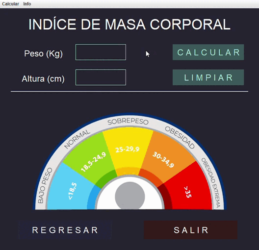
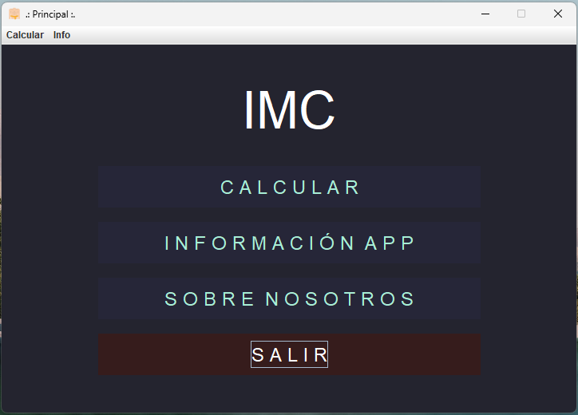

# Calculadora de Masa Muscular (IMC) en Java

Aplicación de escritorio desarrollada en Java que permite calcular el Índice de Masa Corporal (IMC) de un usuario basándose en su peso y altura. El sistema procesa los datos y clasifica automáticamente el estado de salud según los estándares internacionales.

> **Nota:** Este proyecto fue generado utilizando el entorno de desarrollo (IDE) NetBeans, e incluye la estructura estándar de compilación.



## Funcionalidades

- **Cálculo Preciso:** Cálculo matemático para determinar el IMC.
- **Clasificación de Salud:** Indica si el usuario está en "Bajo peso", "Peso normal", "Sobrepeso" u "Obesidad" y muestra visualmente en que categoría te encuentras.
- **Validación de Datos:** Manejo de excepciones para evitar errores si se introducen caracteres que no sean números enteros.

## Tecnologías Utilizadas

*  **Java:** Lenguaje principal (100% del código).
* **Ant Build System:** Gestión de la construcción del proyecto (archivo `build.xml`).

## Estructura del Proyecto

```text
calculadora-masa-muscular/
├── nbproject/       # Configuraciones del proyecto (NetBeans)
├── src/             # Código fuente (.java) y recursos gráficos
├── screenshots/     # Capturas de pantalla para la documentación (README)
├── build.xml        # Script de construcción de Ant
├── manifest.mf      # Metadatos del archivo JAR
└── README.md        # Documentación
```

## Instrucciones de Ejecución
Para correr este programa en tu computadora, necesitas tener instalado el JDK (Java Development Kit).



### Opción A: Desde un IDE (Recomendado)
Abre NetBeans, IntelliJ o Eclipse.

Selecciona "File" > "Open Project".

Navega a la carpeta donde clonaste este repositorio y ábrelo.

Ejecuta el archivo principal (Main.java o similar dentro de src).

## Estado del Proyecto
Lenguaje: Java.

Estado: 🟢 Finalizado.

## Autores

<p style="font-size: 22px; font-family: 'Georgia', serif; line-height: 1.6;">
  • <strong><a href="https://github.com/kevinmontilla">Kevin Montilla</a></strong><br>
  • <strong><a href="https://github.com/carlosluna1611">Carlos Luna</a></strong>
</p>
